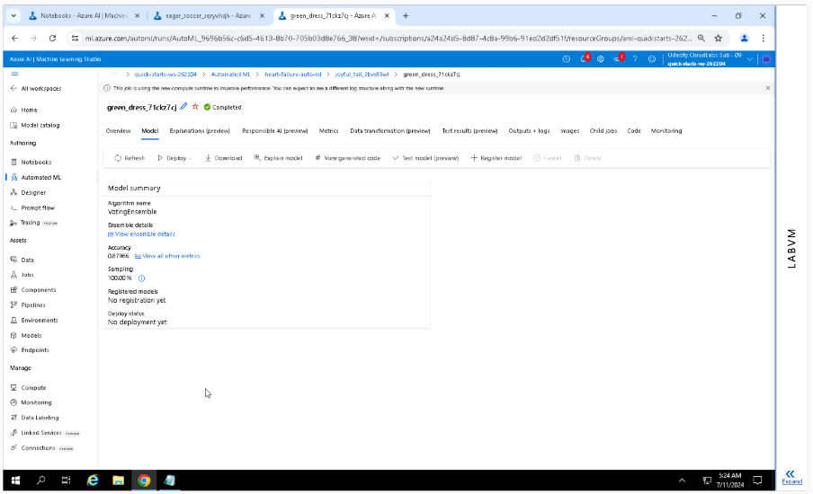

# Capstone Project - Auto ML and Hyperparameter-Tuning

In this project, I used heart failure dataset(https://www.kaggle.com/datasets/andrewmvd/heart-failure-clinical-data). 
Downloaded this dataset from the kaggle website and uploaded to Azure ML Studio. This data generally contains data about people and has health related data with the DEATH-EVENT column. Generally, we have to predict early detection of Heart rate failure using Machine Learning models.

Heart failure is a common event caused by Cardiovascular diseases and this dataset contains 12 features that can be used to predict mortality by heart failure. Reason for AutoML and Hyperparameter-tuning - Need early detection and management. We can predict early detecition of heart problems and take appropriate actions before-hand.

## Project Set Up and Installation
1. Upload Dataset to Azure Machine Learning workspace.
2. Automated ML on this dataset
3. Hyperparameter Tuning in this dataset
4. Deploy the best model given out of AutoMl & Hyperparameter tuning
5. Test the Model Endpoint using test data

## Dataset

### Overview
Heart failure dataset(https://www.kaggle.com/datasets/andrewmvd/heart-failure-clinical-data). Columns in dataset are - age, anaemia creatinine_phosphokinase, diabetes, ejection_fraction, high_blood_pressure platelets, serum_creatinine, serum_sodium, sex smoking time, DEATH_EVENT. This dataset contains records of medical data from 299 patients.

### Task
Heart failure is a common event caused by Cardiovascular diseases and this dataset contains 12 features that can be used to predict mortality by heart failure. 
AutoML and Hyperparameter-tuning machine learning models will early detect the Heart-failure event.

### Access
Downloaded and registered the data from kaggle into Azure ML Studio manually, uploaded the csv and registered it as an Azure ML dataset.

## Automated ML
Field to predict - DEATH_EVENT -> Based on the given features, we need to predict if person will get heart-failure or not.
It is a classification problem, we choose "primary_metric": "accuracy" in the automl_settings.
Accuracy is the ratio of the number of correct predictions to the total number of predictions. It is commonly mettric used for classification tasks where the model needs to predict discrete labels (in our case DEATH_EVENT).

"experiment_timeout_minutes": 20 = This sets a time limit for the entire AutoML experiment, which is 20 minutes in this case. The experiment will run for a maximum of 20 minutes. If it doesn't finish within this time, it will stop regardless of whether it has tested all possible configurations or not. This is useful for ensuring experiments do not run indefinitely and helps in managing computational resources.

"max_concurrent_iterations": 5 = This specifies the maximum number of iterations (model training runs) that can be executed concurrently. Running multiple iterations in parallel can speed up the experiment by utilizing available computational resources efficiently. In this case, up to 5 iterations can run simultaneously.

Auto ML Expermiment : Running

Auto ML Expermiment : Completed

### Results
The best Auto ML experiment model is given by Voting Ensemble Algorithm.
Best Model run-id : AutoML_9696b56c-c6d5-4613-8b70-705b03d8e766_38

Best Model Metrics: {'average_precision_score_micro': 0.9230770839895005, 'matthews_correlation': 0.7339087923298022, 'AUC_macro': 0.9113505649554277, 'norm_macro_recall': 0.6975693474463498, 'balanced_accuracy': 0.8487846737231749, 'precision_score_weighted': 0.8931080901856763, 'log_loss': 0.3704745668532982, 'AUC_micro': 0.9201171885321706, 'AUC_weighted': 0.9113505649554277, 'average_precision_score_macro': 0.8970914218922355, 'f1_score_micro': 0.8796551724137931, 'accuracy': 0.8796551724137931, 'f1_score_weighted': 0.8754946655912134, 'recall_score_macro': 0.8487846737231749, 'recall_score_weighted': 0.8796551724137931, 'recall_score_micro': 0.8796551724137931, 'average_precision_score_weighted': 0.9230099501869831, 'f1_score_macro': 0.8551825487132175, 'precision_score_micro': 0.8796551724137931, 'precision_score_macro': 0.8888301698301697, 'confusion_matrix': 'aml://artifactId/ExperimentRun/dcid.AutoML_9696b56c-c6d5-4613-8b70-705b03d8e766_38/confusion_matrix', 'weighted_accuracy': 0.8988343837358528, 'accuracy_table': 'aml://artifactId/ExperimentRun/dcid.AutoML_9696b56c-c6d5-4613-8b70-705b03d8e766_38/accuracy_table'}

Best Model Accuracy: 0.8796551724137931

More details on best Model Pipeline(steps=[('datatransformer',
                 DataTransformer(enable_dnn=False, enable_feature_sweeping=True, is_cross_validation=True, working_dir='/mnt/batch/tasks/shared/LS_root/mounts/clusters/notebook262204/code/Users/odl_user_262204')),
                ('prefittedsoftvotingclassifier',
                 PreFittedSoftVotingClassifier(classification_labels=array([0, 1]), estimators=[('18', Pipeli...roblem_info=ProblemInfo(gpu_training_param_dict={'processing_unit_type': 'cpu'}), reg_alpha=0, reg_lambda=1.9791666666666667, subsample=0.9, tree_method='auto'))]))], flatten_transform=False, weights=[0.1111111111111111, 0.1111111111111111, 0.1111111111111111, 0.1111111111111111, 0.2222222222222222, 0.1111111111111111, 0.1111111111111111, 0.1111111111111111]))])

For Future Improvement : "experiment_timeout_minutes" could be increased beyond 20 mins, we may get better accuracy. We may also try to change target-column to do prediction.

## Hyperparameter Tuning
RandomParameterSampling - It's a way to explore different configurations for your machine learning model by randomly selecting values for its hyperparameters.
    Advantages - 
    Simple to implement.
    Works well for small search spaces.
    Can explore the entire search space efficiently.

"learning_rate" - I used Choice class to give discrete learning rates
"n_estimators" - It is a hyperparameter specific to ensemble methods like Random Forest or Gradient Boosting. It defines the number of individual estimators (decision trees) used in the ensemble.

BanditPolicy - This is an early stopping policy that helps in terminating poorly performing runs early, based on performance compared to the best run.
evaluation_interval - It is the frequency at which the policy assesses the performance of ongoing runs and potentially terminates them. If not specified, it defaults to 1, meaning the policy is applied after every run.
slack_factor - It specifies the allowed "slack" in performance metric between a running configuration and the best performing configuration (leader) found so far.

In this capstone project I have used Gradient boosting. Gradient boosting is a powerful machine learning technique that falls under the umbrella of ensemble methods. It works by combining multiple weak learners (models with relatively low accuracy) into a single strong learner (a model with high accuracy). Gradient boosting leverages the idea of ensemble learning, where multiple models are trained and their predictions are combined to create a more robust and accurate model.

### Results
These are the results from this hyperparameter experiment
Best Model Run ID: HD_1ddba5c3-a162-484c-b536-014bb1d4a2fd_15

Best Model Metrics: {'Learning Rate:': 0.8, 'Number of Estimators:': 5, 'Accuracy': 0.8}

Best Model Accuracy: 0.8

## Model Deployment
We deployed the best model from the AutoML experiment as a web service endpoint and tested it with three randomly chosen samples.

"data": [
    {
      "age": 24.0,
      "anaemia": 0,
      "creatinine_phosphokinase": 0,
      "diabetes": 0,
      "ejection_fraction": 0,
      "high_blood_pressure": 0,
      "platelets": 0.0,
      "serum_creatinine": 0.0,
      "serum_sodium": 0,
      "sex": 1,
      "smoking": 1,
      "time": 0
    }
  ]

url = 'http://0d933ba4-294a-4401-9531-16b1fd1ad803.westus2.azurecontainer.io/score'

Output - b'[1]'

Model deployment - 

Application Insights Enaled - False

Application Insights Enaled - True

## Screen Recording
https://drive.google.com/file/d/12SAjyld_m-LZZvDzoZjEdoZ9drYg1ve8/view?usp=sharing

## Cluster and service delete

